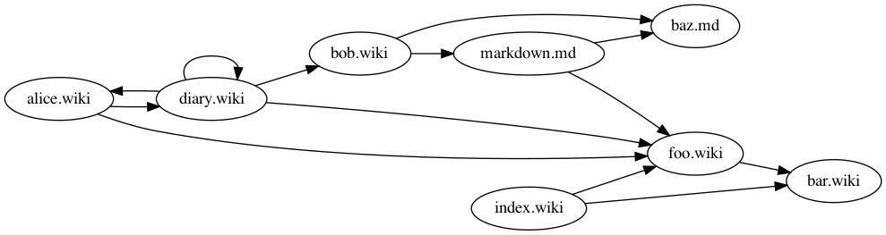
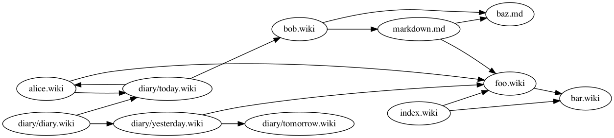
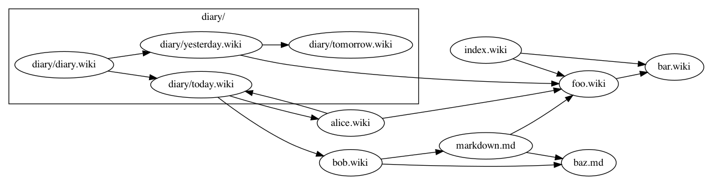

## vimwikigraph - visualise vimwiki links using graphviz dot language
`vimwikigraph` walks all files in a
[vimwiki](https://github.com/vimwiki/vimwiki) directory and builds a
graph between the encountered files and their internal references. The
code supports vimwiki-style links `[[link]]`, `[[link|description]]`
and markdown-style links `(description)[link]`. The graph is
converted to the DOT language
using [`dot`](https://github.com/emicklei/dot). The results can then be
visualised with [graphviz](https://www.graphviz.org/about/), e.g. using
`dot`, `neato`, `fdp`, etc.

The graph visualises your notes and their connections, possibly
providing new insights.

## Usage
```
./vimwikigraph $HOME/vimwiki | dot -Tpng > test.png && open test.png
```
`-diary`: collapse all diary entries under a single node `diary.wiki`

`-cluster`: cluster subdirectories as subgraphs

`-l`: only nodes with at least `l` edges are inserted. The inserted nodes are
inserted with all their edges. Thus, nodes with less than `l` edges can appear
when they are connected to other nodes that do satisfy the requirement.
For `-l 0`, all nodes are inserted.

## Examples
To illustrate `/example/` contains some `.wiki` files and also a
diary, `/example/diary/*.wiki`. Running `vimwikigraph` produces the
following output. All `diary` files are collapse by default into a
single node. Any connections to and from any diary files are simply
an arrow point in to, or out of, the diary.
```
./vimwikigraph example | dot -Tpng > example.png
```


The `-diary` flag ensures all diary items are shown as nodes.
```
./vimwikigraph example -diary | dot -Tpng > example.png
```


The `-cluster` flag adds all diary items to a subgraph.
```
./vimwikigraph example -diary -cluster | dot -Tpng > example.png
```


## Installation
```
go get github.com/maxvdkolk/vimwikigraph
```
